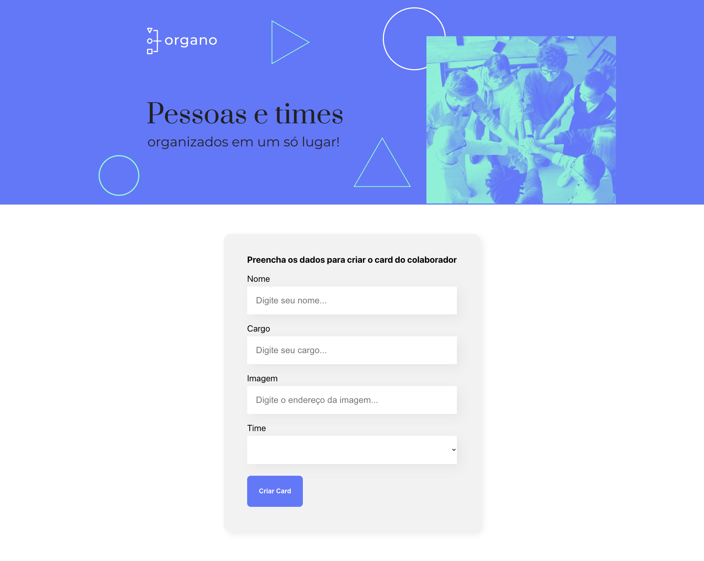

# 🧑‍🏫 Organo

Aplicação em React + TypeScript desenvolvida como projeto inicial durante o curso **"React: desenvolvendo com JavaScript"** na Alura. Serve para praticar conceitos como hooks, tipagem e organização de componentes.



---

## 🚀 Funcionalidades

- Cadastro de instrutores e organização por escolas
- Interface responsiva com componentes reutilizáveis
- Utilização de React Hooks e props tipadas
- Estrutura modular e boas práticas de React com TypeScript

---

## 🛠️ Tecnologias utilizadas

- React  
- TypeScript  
- React Hooks  
- CSS3  
- Vite   
- Vercel (para deploy)

---

## 💻 Como rodar o projeto localmente

```bash
# Clone o repositório
git clone https://github.com/A1AD10/organo-ts.git

# Acesse a pasta do projeto
cd organo-ts

# Instale as dependências
npm install

# Inicie o servidor de desenvolvimento
npm start

Abra http://localhost:3000 no seu navegador para visualizar.
```

---

## 🌐 Link para acesso online

➡️ [organo-ts-mocha.vercel.app](https://organo-ts-mocha.vercel.app)

---

## 📌 Observações

Desenvolvido como primeiro contato com React, focando em:

- Organização de código com componentes reutilizáveis  
- Tipagem estática com TypeScript  
- Aplicação de boas práticas para desenvolvimento front-end  
- Estruturação visual simples e funcional

---

## 📈 Possíveis melhorias futuras
 
- ✅ Navegação com React Router  
- ✅ Implementar dark mode  
- ✅ Melhorar acessibilidade performance geral

---

## 👨‍💻 Desenvolvedor

**Aladio Vanderlei de Lima Junior**  
🔗 [LinkedIn](https://www.linkedin.com/in/aladio-junior285)  
🌐 [Portfólio](https://meu-portfolio-opal-pi.vercel.app)

